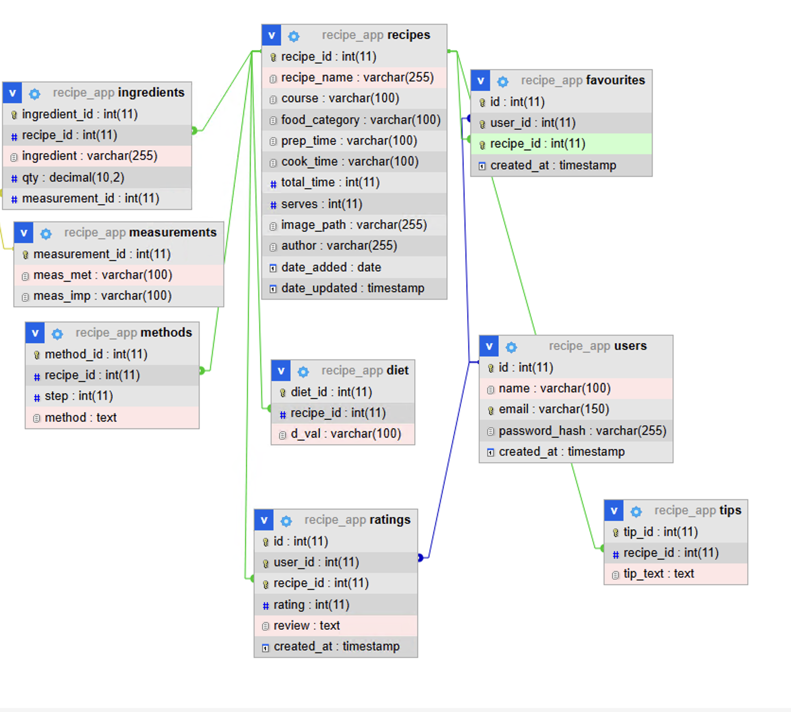

# Recipe Web Application

This project requires PHP version **>= 8.0**.

---

## Table of Contents

1. [Overview](#overview)  
2. [Features](#features)  
3. [Requirements](#requirements)  
4. [Setup Instructions](#setup-instructions)  
5. [Database Setup](#database-setup)  
6. [Project Structure](#project-structure)  
7. [Data Models](#data-models)  
8. [Testing](#testing)  
9. [Frontend Details](#frontend-details)  

---

## Overview

This is a web application that manages **Users**, **Recipes**, **Ingredients**, **Dietary Information**, **Ratings**, and **Favourites**.

The system consists of:

- a **backend** implemented in PHP using MySQL  
- a **frontend GUI** built with PHP and HTML  

The application allows users to search, filter, and interact with recipes using:
- ingredients  
- dietary requirements  
- category  
- cooking time  
- ratings  

The project includes a **full SQL database dump** for easy setup and reproducibility.

---

## Features

### Users
- Create accounts  
- View user data  

### Recipes
- View recipes  
- Search and filter recipes  

### Favourites
- Add recipes to favourites  
- View favourite recipes  
- Remove recipes from favourites  

### Ratings
- Add ratings  
- View ratings for recipes  

---

### Database
- MySQL relational database  
- Normalised schema with foreign key relationships  
- Includes SQL dump with sample data  

---

### Backend
- PHP version **8.x**
- Uses PDO prepared statements for secure database queries  
- Database initialised using included SQL dump (`recipe_app.sql`)  
- Dynamic SQL queries for filtering (search, ingredient, diet, category, time)  

---

### Frontend (GUI)
- Implemented using PHP and HTML  
- Server-rendered pages combining backend logic and frontend output  
- Pages include:
  - Home  
  - Search  
  - Account  
  - Favourites  
  - Register  
  - Login  
  - Logout  
- Built using Figma prototype:  
  https://www.figma.com/proto/VvxTSrUMR9tRrcQOlN5tRj/CSCK543---Group-Project?node-id=0-1&t=A1CvBkIpVisALOvu-1  

---

## Requirements

- PHP >= 8.0  
- MySQL / MariaDB  
- Apache server (e.g. XAMPP)  
- Web browser  

---

## Setup Instructions

1. Extract the ZIP file  

2. Move the project folder into:
C:\xampp\htdocs\

3. Start Apache and MySQL using XAMPP  

4. Create the database:

  ```sql
  CREATE DATABASE recipe_app;

5. Import the SQL dump

6. Open the application:

  http://localhost/recipe-web-app/public/


---

## Database Setup

The project includes a SQL dump file:
  recipe_app.sql


To initialise the database:

1. Open phpMyAdmin  
2. Select `recipe_app`  
3. Go to **Import**  
4. Upload the `.sql` file  

This will:

- create all tables  
- apply constraints  
- insert sample data  

---

## Project Structure
  recipe-web-app/
  │
  ├── public/
  │   ├── index.php
  │   ├── search.php
  │   ├── recipe.php
  │   ├── account.php
  │   ├── favourites.php
  │   ├── login.php
  │   ├── logout.php
  │   ├── rate_recipe.php
  │   ├── register.php
  │   ├── remove_favourite.php
  │   ├── save_favourite.php
  │
  ├── includes/
  │   ├── db.php
  │   ├── auth.php
  │   ├── validation.php
  │
  ├── database/
  │   └── schema.sql
  │
  ├── scripts/
  │   └── scripts/create_recipe_tables_last_2300.php
  │
  └── README.md

## Data Models

